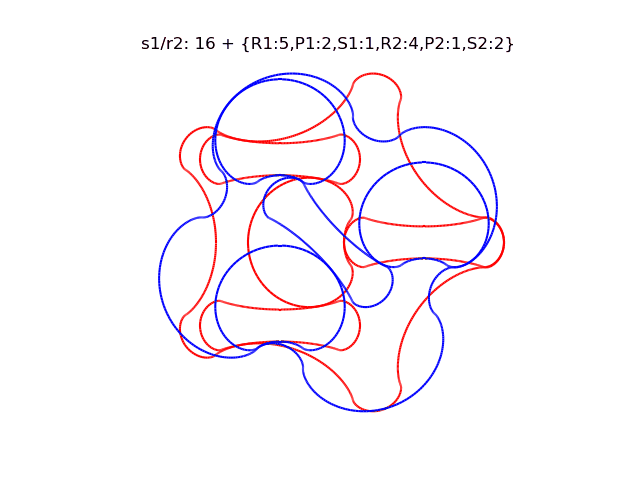
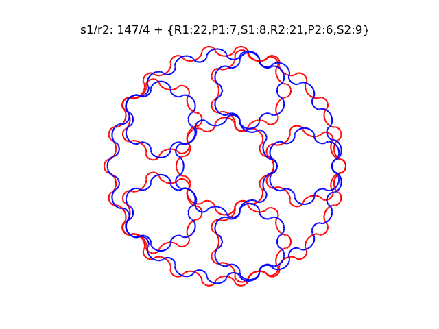
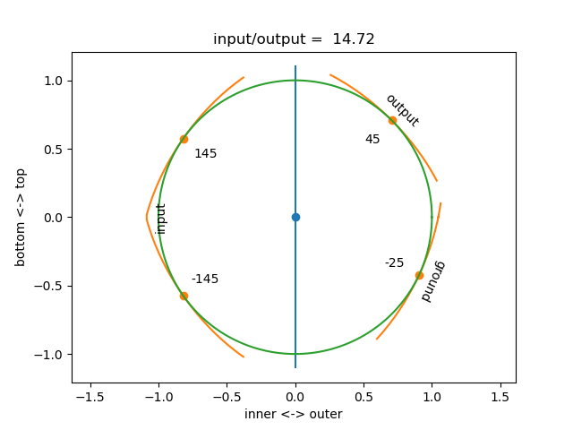
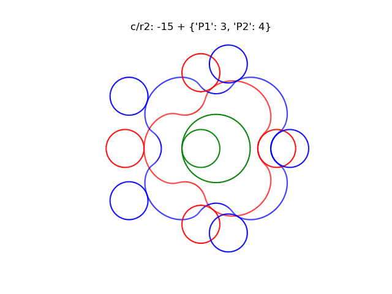

# pygeartrain
Gear train calculations, visualizations, optimizations, and CAD export

a simple self contained but nontrivial example shows how to formulate a planetary gearing system, and uses it obtain a formula for the gear ratio:

```python
class Planetary(GearKinematics):
    equations = [
        'S * s + P * p - (S + P) * c',  # planet-sun contact
        'R * r - P * p - (R - P) * c',  # planet-ring contact
    ]
print(Planetary('s', 'c', 'r'))     # sun-input, carrier-output, fixed-ring
```
Output:
```
>>> s/c: (R + S)/S
```
Moreover, we can create concrete gear profile geometries,
and plot and animate these to validate their intended functioning, 
as well as extrude and export them for futher use.

Some examples of currently implemented gear trains are given below:

Compound planetaries: lowest known tooth count compound planetary:



A more practical low tooth count planetary, suitable for 3d printing due to its large minimum feature size



4-point angular contact transmissions



Cycloidal drives




