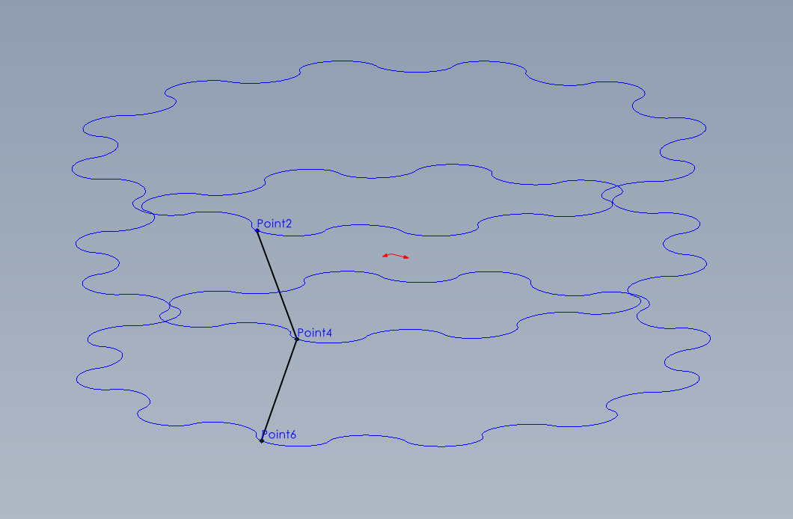
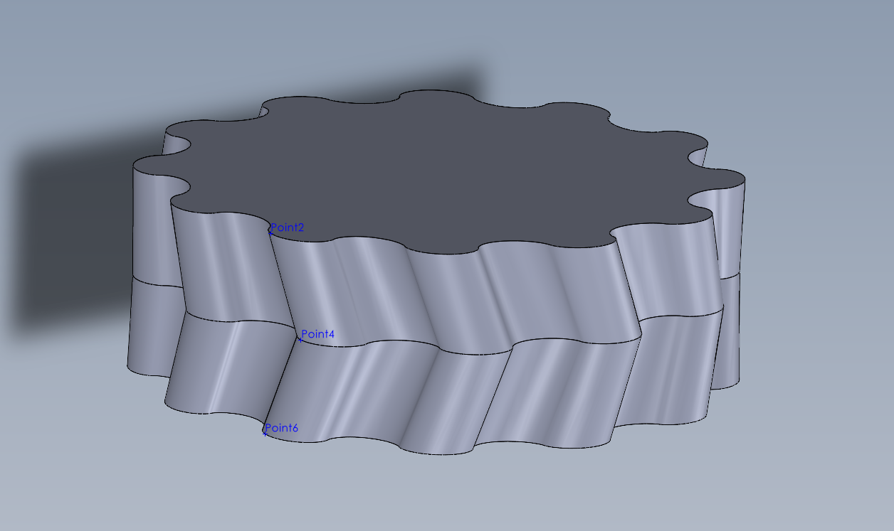

# pygeartrain

[](https://opensource.org/licenses/MIT)

Python library for gear train calculations, visualizations, optimizations, and CAD profile export.

## Features

*   Symbolic calculation of gear ratios for various geartrain types.
*   Generation of 2D gear profiles (cycloidal, epi/hypo mix, involute - WIP).
*   Visualization and animation of geartrain kinematics using Matplotlib.
*   Export of gear profiles coordinates suitable for CAD import (e.g., SolidWorks).
*   Support for standard planetary, compound planetary (Wolfram), cycloidal, compound cycloidal, Nabtesco-style, and angular contact drives.

## Examples

Some examples of currently implemented gear trains:

**Compound Planetary (High Ratio)**<br />
")<br />

**Compound Planetary (Printable Low Count)**<br />
")<br />

**Angular Contact Drive**<br />
<br />

**Cycloidal Drive**<br />
<br />

## Installation & Environment Setup

This project uses Conda for environment management.

**Prerequisites:**
*   [Conda](https://docs.conda.io/en/latest/) (Miniconda is recommended: [https://docs.conda.io/en/latest/miniconda.html](https://docs.conda.io/en/latest/miniconda.html))
*   [Git](https://git-scm.com/) (for cloning the repository)

**Steps:**

1.  **Clone the repository:**
    ```bash
    git clone <repository_url> pygeartrain
    cd pygeartrain
    ```
    (Replace `<repository_url>` with the actual URL of the repository. Alternatively, download and extract the source code).

2.  **Create the Conda Environment:**
    Open your terminal or Anaconda Prompt in the `pygeartrain` directory (where `environment.yml` is located) and run:
    ```bash
    conda env create -f environment.yml
    ```
    *(Optional, faster alternative if you have Mamba installed: `mamba env create -f environment.yml`)*

3.  **Activate the Environment:**
    Each time you want to work with this project in a new terminal session, activate the environment:
    ```bash
    conda activate pygeartrain
    ```
    You should see `(pygeartrain)` appear at the beginning of your terminal prompt.

## Basic Usage: Calculating Ratios

You can define the kinematics of a geartrain and calculate its ratio symbolically:

```python
from pygeartrain.planetary import Planetary

# Define kinematics: Input='s' (sun), Output='c' (carrier), Fixed='r' (ring)
kinematics = Planetary('s', 'c', 'r')

# Print the kinematic definition and the calculated ratio formula
print(kinematics)
# >>> s/c: (R + S)/S
```

## Advanced Usage: Generating CAD Profiles for SolidWorks

Right now I've made `generate_planetary_cad.py` which only works for planetary gears. Generating the other gear types shouldn't be too hard following this script.

**1. Configuration:**

   Open the `generate_planetary_cad.py` script in a text editor. Modify the parameters in the "**User Defined Parameters**" section near the top:

   *   `TARGET_RING_DIAMETER_MM`: Set the desired outer diameter (in mm) for the final scaled ring gear. All other gears are scaled proportionally.
   *   `GEAR_THICKNESS_MM`: Set the total face width (along the Z-axis) for the gears.
   *   `HELIX_ANGLE_DEGREES`: Define the helix angle (in degrees) for one side of the gear tooth (used for both helix and herringbone).
   *   `GEAR_TYPE`: Choose `'helix'` for standard helical gears or `'herringbone'` for double-helical (V-shaped) gears.
   *   `R_teeth`, `P_teeth`, `S_teeth`: Set the tooth counts for the Ring, Planet, and Sun gears. Ensure they satisfy the planetary assembly condition: `R = S + 2*P`.
   *   `N_planets`: Set the number of planet gears around the sun.
   *   *(Optional)* `b_profile`: Adjust the epi/hypo cycloid mix ratio (0 to 1) for the tooth shape.
   *   *(Optional)* `CARRIER_PATH_POINTS`: Number of points for the exported circular carrier path file.
   *   *(Optional)* `CLOSE_POINT_TOLERANCE`, `SMALL_RADIUS_TOLERANCE`: Adjust point filtering sensitivity if needed.

**2. Running the Export Script:**

   Make sure the `pygeartrain` environment is active (`conda activate pygeartrain`). Run the script from the main project directory:

   ```bash
   python generate_planetary_cad.py
   ```

**3. Understanding the Output:**

   The script will create a directory named `output_helix` or `output_herringbone` containing several `.txt` files:

   *   **Gear Profile Curves:** 9 files for the gear teeth, 3 for each gear type (ring, planet, sun).
        *   `*_z0.txt`: The profile curve at the center plane (Z=0).
        *   `*_z_pos.txt`: The profile curve twisted for the +Z face (at Z = +thickness/2).
        *   `*_z_neg.txt`: The profile curve twisted for the -Z face (at Z = -thickness/2).
        *(The twist direction and type depend on the `HELIX_ANGLE_DEGREES` and `GEAR_TYPE` settings, with meshing hands automatically adjusted).*
   *   **Carrier Path:** 1 file:
        *   `carrier_path.txt`: A simple circle representing the path of the planet gear centers, useful for positioning planets in an assembly. Lies in the Z=0 plane.

   All coordinates in the files are in millimeters, scaled according to `TARGET_RING_DIAMETER_MM`.

**4. Importing into SolidWorks:**

   *  Create a new SolidWorks Part file.
   *  Import the 3 curves for **one gear** (e.g., `ring_21_z_neg.txt`, `ring_21_z0.txt`, `ring_21_z_pos.txt`):
       *   Go to **Insert > Curve > Curve Through XYZ Points**.
       *   **Browse** and select the first file (e.g., `_z_neg.txt`). Click **OK**.
       *   Repeat for the `_z0.txt` and `_z_pos.txt` files of the *same gear*. The curves should appear positioned correctly in 3D space.
   *  Select the three imported curves for that gear in the FeatureManager Design Tree.
   *  Click point in reference geometry and select one of the imported curves (do this for all 3 curves)
   *  Create a 3D sketch with two lines between the 3 points you just added in order to create a loft guide. You shoud have something looking like this.
   
   *  Create the gear body by creating two lofts separatly for either side using **Insert > Boss/Base > Loft** (or **Insert > Surface > Loft**). Use the 3D sketch as a guide for both of them.
   
   *  Repeat steps for the Sun and Planet gears using their respective curve files.
   *  **For the Planet:** After creating the single lofted planet gear body, use the **Circular Pattern** feature (**Insert > Pattern/Mirror > Circular Pattern**) to create `N_planets` instances around the part origin.
   *  **Carrier Path (Optional):** Import `carrier_path.txt` onto a sketch on the Front Plane (Z=0) using **Insert > Curve > Curve Through XYZ Points**. Solidworks doesnt recognize this as a circle so you can create a circle on the XY plane and set it to have a point coincident to the carrier path curve. This circle can be used as a construction reference for designing the physical carrier or for assembly mates.

## Animation

The geometry objects generated by the library (like `PlanetaryGeometry`) often have an `.animate()` method. You can call this in your script (after creating the `gear` object) to visualize the kinematic motion using Matplotlib.

```python
# Assuming 'gear' is a created PlanetaryGeometry object
# gear.animate() # Call this instead of static plotting
# plt.show() # Not needed if calling animate()
```

*Note: The animation shows the **unscaled** gear profiles to verify meshing and relative speeds based on the kinematics.*

## License

This project is licensed under the MIT License - see the [LICENSE](LICENSE) file for details.
